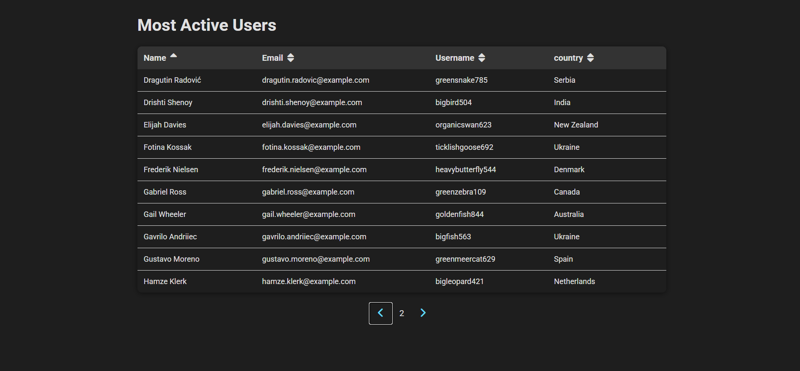

# 📊 Professional Data Table

A modern and professional data table for displaying user information with advanced sorting, pagination, and dark theme functionality.

## ✨ Features

- 🔄 **Dynamic Loading** - Data is fetched from RandomUser API
- 📱 **Responsive Design** - Optimized for all devices
- 🌙 **Dark Theme** - Toggle between light and dark modes
- 🔍 **Interactive Sorting** - Click headers for ascending/descending sort
- 📄 **Pagination** - Navigate through pages with 10 records per page
- ⚡ **Loading Spinner** - Elegant loading indicator
- 🎨 **Modern Design** - Clean and professional interface

## 🚀 Live Demo

[🔗 Live Demo Link](https://lambrugeorge.github.io/Professional-Table/) 

## 📸 Screenshots

### Light Mode


### Dark Mode  


## 🛠️ Technologies Used

- **HTML5** - Page structure
- **CSS3** - Modern styling with CSS Variables
- **JavaScript (ES6+)** - Interactive functionality
- **Font Awesome** - Interface icons
- **Google Fonts (Roboto)** - Modern typography
- **RandomUser API** - Test data generation

## 📁 Project Structure

```
Professional-Table/
├── index.html          # Main HTML structure
├── style.css           # CSS styling with variables
├── script.js           # JavaScript logic
├── README.md           # Project documentation
├── lightmode.png       # Light mode screenshot
└── darkmode.png        # Dark mode screenshot
```

## 🎯 Detailed Features

### 📊 Data Table
- Displays user information: name, email, username, country
- Responsive design with adaptable columns
- Hover effects for interactive experience

### 🔄 Sorting
- Sort on all columns (name, email, username, country)
- Visual indicators for sort direction (↑↓)
- Alphabetical sorting with `localeCompare()`

### 📄 Pagination
- 10 records per page
- Navigation with Previous/Next buttons
- Current page number display
- Buttons disabled when not relevant

### 🌙 Dark Theme
- Instant switching between modes
- Preference persistence in localStorage
- Smooth transitions for pleasant experience
- CSS variables for consistency

### 📱 Responsive Design
- Mobile-adapted layout
- Table transformed into cards on small screens
- Labels for each field on mobile